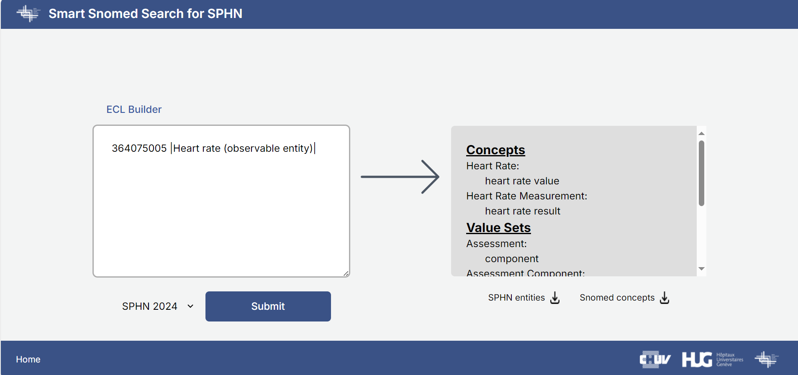
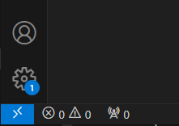

# S4: Smart SNOMED Search for SPHN

**S4** is a web application designed to facilitate the usage of the SPHN Dataset by providing an easy way to translate from SNOMED CT concepts and queries to SPHN concepts and value sets. It leverages Next.js to provide a seamless and efficient user experience.



## Acknowledgment
- **SPHN (Swiss Personalized Health Network)**: This project has been funded by the SPHN, a national initiative aimed at advancing personalized and precision medicine in Switzerland by promoting the development, implementation, and validation of innovative health data infrastructures. More information [here](https://sphn.ch/).

## Project Collaboration

This project is a collaborative effort between the following institutions:

- **Medical Information Sciences Division (SIMED), Geneva University Hospitals**: The [SIMED](https://www.hug.ch/sciences-de-linformation-medicale), led by Pr Christian Lovis, uses data science and AI to tackle hospital challenges, improving patient care, streamlining processes, and enhancing decision-making for healthcare professionals. They develop predictive models, advance clinical text analysis, and create efficient knowledge management tools. The team works closely with clinicians, IT specialists, and researchers to ensure their work aligns with hospital priorities and benefits patient outcomes. 

- **Clinical Data Science (CDS) group, Biomedical Data Science Center, Lausanne University Hospital (CHUV)**: The [Clinical Data Science group](https://www.chuv.ch/en/bdsc/research/our-groups/clinical-data-science), led by Pr Jean Louis Raisaro, focuses on the development and application of innovative solutions based on data science and artificial intelligence to improve service delivery, management and planning for clinical healthcare. These solutions integrate and enable the representation of multimodal health data, as well as the anonymization of health data for clinical research and the distribution of analyses for multi-center projects. A set of these solutions apply machine learning algorithms to patient data for predictive purposes to support clinical decision making.

## Table of Contents

1. [Features](#features)
2. [Setup and Installation](#setup-and-installation)
3. [Code Organization](#code-organization)
4. [How It Works](#how-it-works)
5. [Contributing](#contributing)
6. [License](#license)

## Features

S4 offers a range of features designed to enhance the efficiency and accuracy of translating SNOMED CT concepts into SPHN concepts and value sets:

- **Advanced SNOMED CT Concept Search**: Perform fast and flexible searches for SPHN concepts using ECL (Expression Constraint Language) queries from Snomed language.
- **Custom ECL Builder**: Use the intuitive ECL Builder to construct complex queries easily, without needing deep ECL syntax knowledge.
- **SPHN Concept Mapping**: Automatically maps SNOMED CT concepts to SPHN (Swiss Personalized Health Network) concepts using the latest dictionaries.
- **Multi-Year Support**: Query different SPHN datasets based on the selected dictionary year (2023, 2024).
- **Data Visualization**: View search results in a user-friendly interface with options to download results as CSV files.
- **Batch Processing**: Efficiently handle large results with built-in pagination and batch processing.
- **Responsive Design**: Enjoy a seamless experience across all devices, with a fully responsive design.
- **Integration with Snowstorm API**: Robust integration with the Snowstorm API for scalable SNOMED CT concept searching.

## Setup and Installation

Follow these steps to set up and run the S4 application on your local machine. This includes installing necessary dependencies, setting up the environment, and running the application in a Docker container.

### Prerequisites

Before you begin, ensure you have the following installed:

- **Docker**
- **VS Code**
- **Git** (optional, for cloning the repository)

### Installation Steps

1. **Clone the repository**:

   ```bash
   git clone <repository address>
   cd S4-project
   ```

2. **Deploy a Snowstorm Server**:

   In order to create ECL queries and parse them, you need a [Snowstorm](https://github.com/IHTSDO/snowstorm) server. Snowstorm is an open source terminology server with special support for SNOMED CT. You can either deploy it yourself by following the installation instructions on [Snowstorm's Github page](https://github.com/IHTSDO/snowstorm),or use a public instance (note that public instances might be slower and less reliable).

3. **Setup the environment variables**:

   Open the project in VS Code and create a file called `.env` at the root of the project. If you deployed a local Snowstorm server as mentioned in the previous step, write its url in the following form:

   ```python
    SNOWSTORM_SERVER="https://SNOWSTORM_URL:PORT"
   ```

   If you put a login and password into your local Snowstorm instance, write them in this file as well:

   ```python
    SNOWSTORM_LOGIN="your-login"
    SNOWSTORM_PASSWORD="your-password"
   ```

   If you did not deploy a Snowstorm instance, use a public Snowstorm instance such as this one:

   ```python
    SNOWSTORM_SERVER="https://browser.ihtsdotools.org/snowstorm/snomed-ct"
   ```

5. **Run the development server**:

   In VS Code, install the `Dev Containers` plugin if not installed yet.
   Next, click on the blue button on the bottom left corner of the screen and click on "Reopen in Container".

   

   Now you should have a new window opened in the docker container. In the terminal, run:

   ```bash
    pnpm install
    pnpm dev
   ```

   The application will be available at http://localhost:3000.

6. **Building for production**:

   To build the project for production, reopen the project in the dev container in the same way as for the development server.
   In the terminal, run:

   ```bash
      pnpm build
      pnpm start
   ```

   The application will be available at http://localhost:3000.

## Code Organization

The project is organized into the following key directories and files:

- **`/src`**: Contains the main code of the application.

  - **`/app`**: Contains the main application components and pages.

    - **`_components`**: Reusable components like the navigation bar and the welcome page.
    - **`/api`**: Includes the `trpc` directory and the root router for the API.
    - **`/snowstorm`**: The routing logic to access the Snowstorm server and its different endpoints.
    - **`/translate`**: The main Snomed-SPHN translation page.
    - **`layout.tsx`**: The layout that wraps the entire application.
    - **`page.tsx`**: The Home page of the application.

  - **`/data`**: JSON files used by the application to map Snomed concepts to SPHN.
  - **`/server`**: Server-side utilities and API definitions.

    - **`/server/api/routers/sphndict.ts`**: Contains the whole logic of receiving user input, sending queries to Snowstorm, parsing them and mapping the results to SPHN concepts and value sets using the JSON files in /data.

  - **`/styles`**: Global styles and Tailwind CSS configuration.
  - **`/trpc`**: Trpc routing configuration.
  - **`/utils`**: Utility functions like `authHeaderSnowstorm` which detects whether authentication is needed for Snowstorm and adds corresponding headers.

- **`.env`**: Environment variables are managed here.
- **`.env.example`**: Environment variables example.
- **`/.devcontainer`**: Configuration to create the Docker container within which we run the application.
- **`/public`**: Static assets like images and icons.
- **`README.md`**: Documentation for the project.
- **`/images`**: Images used in the README.
- **`.dockerignore`**: Folders and files to be ignored by Docker.
- **`.gitignore`**: Folders and files to be ignored by Git.
- **`.eslintrc.cjs`**: Javascript code helper configuration.
- **`global.d.ts`**: Declare the ECLBuilder for Javascript.
- **`next.config.js`**: Next.js configuration.
- **`package.json`**: Next.js library requirements and commands.
- **`postcss.config.cjs`**: CSS for Javascript library.
- **`prettier.config.js`**: Code formatting configuration.
- **`tailwind.config.ts`**: TailwindCSS configuration.
- **`tsconfig.json`**: Typescript configuration.

## How It Works

### Core Functionality

1. **Snowstorm API Integration**:

   - The application interfaces with the Snowstorm API for querying SNOMED CT concepts. The API requests are authorized using basic authentication, configured via environment variables.

2. **tRPC for API Handling**:

   - The server-side logic is handled using tRPC, providing type-safe API routes. Procedures such as `makeQuery` manage the interaction with the Snowstorm API and the processing of SNOMED CT concepts.

3. **Frontend Components**:

   - The frontend is built with reusable components like `Navbar`, `Welcome`, `SPHN`, and `Query`. These components are rendered on the homepage (`/pages/index.tsx`) and interact with the backend through tRPC calls.

4. **Data Handling**:

   - JSON files containing mappings between SNOMED CT and SPHN concepts are loaded and processed. The application flattens and deduplicates these concepts before rendering them or offering them for download.

5. **Styling**:
   - Tailwind CSS is used for styling, with custom styles applied through the `globals.css` and component-specific classes.

### API Endpoints

This application interacts with various API endpoints to handle requests for querying SNOMED CT concepts and retrieving associated SPHN mappings. The primary API interactions are divided between the tRPC-based application routes and direct Snowstorm server endpoints.

#### tRPC Endpoints

- **`/api/trpc`**:
  - This is the main API endpoint for all tRPC calls within the application.
  - It handles requests such as querying SNOMED CT concepts, retrieving SPHN dictionary mappings, and processing ECL (Expression Constraint Language) queries.
  - The tRPC framework ensures type-safe API routes, facilitating seamless integration between the frontend and backend.

#### Snowstorm Server Endpoints

The following endpoints interact directly with the Snowstorm server, which manages the SNOMED CT terminology services:

- **`/util/ecl-string-to-model`**:

  - Converts an ECL string into a structured model that Snowstorm can process.
  - Useful for interpreting and validating ECL queries.

- **`/util/ecl-model-to-string`**:

  - Converts an ECL model back into its string representation.
  - This is often used to translate model changes or generate query strings.

- **`/MAIN/concepts`**:

  - Retrieves SNOMED CT concepts based on ECL queries.
  - This endpoint is essential for fetching the relevant concepts that are then mapped to SPHN concepts.

- **`/mrcm/MAIN/domain-attributes`**:
  - Retrieves domain attributes within SNOMED CT, which are used for advanced queries and concept validation.

#### Security and Authentication

To ensure secure interaction with the Snowstorm server, authentication headers are injected into API requests where necessary. This approach allows the application to securely access the Snowstorm server without exposing it to the public, thereby maintaining data security and integrity.

### Custom Components

- **`ECLBuilder`**: An imported [web component](https://www.npmjs.com/package/snomed-ecl-builder-vue?activeTab=readme) that assists users in constructing ECL (Expression Constraint Language) queries.

## Contributing

Contributions are welcome! Please fork this repository, make your changes, and submit a pull request. Ensure that your code follows the project's coding standards and includes appropriate documentation.

## License

This work is published under the GNU General Public License v3, please see LICENSE file for more information.